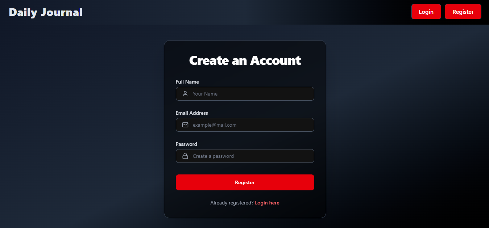
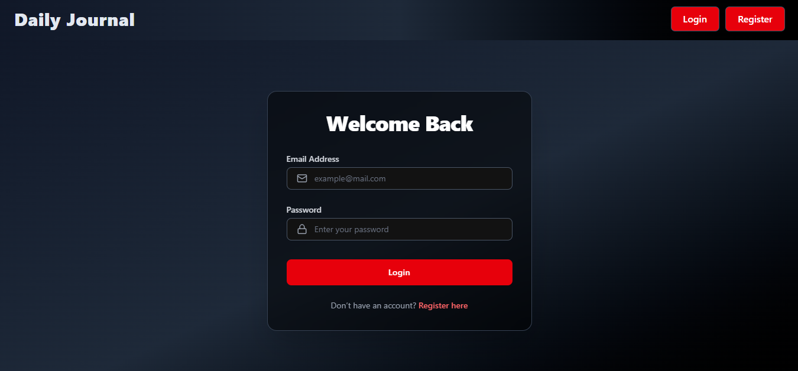
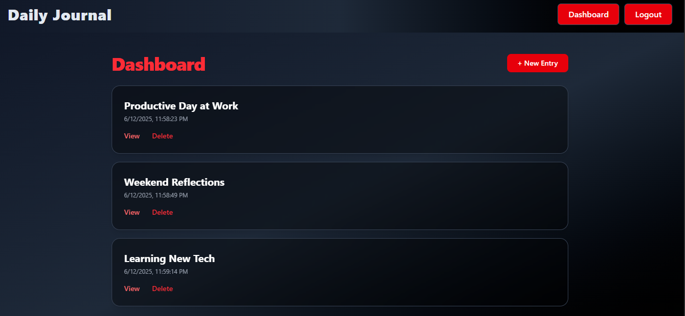

# 📝 Daily Journal App (MERN Stack)

A full-featured **Daily Journal Application** built using the **MERN Stack** (MongoDB, Express, React, Node.js). This application allows users to register, log in, and manage their daily journal entries securely and efficiently. Built with a modern UI using Tailwind CSS and optimized with React Router and Context API for smooth performance and user experience.

---

## 🚀 Features

- 🔐 User Authentication (Register/Login)
- 🧠 CRUD Operations for Journal Entries (Create, Read, Update, Delete)
- 🌓 Responsive Dark-Themed UI using Tailwind CSS
- 🛠️ RESTful API Integration
- ⚙️ Context API for Global State Management
- 📋 Form Validation using Formik + Yup
- 🌐 Axios for Client-Server Communication
- 🧪 Error Handling and JWT Authentication

## 📸 Screenshots

## ⚙️ Tech Stack

| Tech          | Description                        |
|---------------|------------------------------------|
| React         | Frontend Library                   |
| Tailwind CSS  | Utility-First CSS Framework        |
| React Router  | SPA Routing                        |
| Node.js       | Backend Runtime                    |
| Express.js    | Web Framework for Node.js          |
| MongoDB       | NoSQL Database                     |
| Mongoose      | ODM for MongoDB                    |
| Axios         | HTTP Client                        |
| JSON Web Token| User Authentication                |

🙋‍♂️ Author : Mudasir Mujtaba (CS Student, Mern Stack enthusiast)                 
  📧 mudasirmujtaba15@gmail.com
  🔗 https://github.com/Mudasir123r2

📄 License
This project is licensed under the ISC License.

💡 Feel free to fork, improve, and use this project for learning or personal use. Contributions are welcome!

